# DOOS Activity Report — May & June 2026

**Repository:** [earthcube/doos](https://github.com/earthcubeprojects/doos)  
**Reporting period:** 1 May 2026 – 17 June 2026  
**Author:** Douglas Fils  
**Generated:** 17 June 2026

---

## Human Summary

I'm getting a better focus and feel for DOOS in a larger context.
As part of that I'll break this report down into two main sections.
I'll then follow up with how this connects with DeCoder and others.

- Resource focus
  - BCO-DMO: [bco-dmo-scan skill](https://github.com/earthcube/doos/tree/main/skills/bco-dmo-scan)
  - OBIS [OBIS auxillary depth graph](https://github.com/earthcube/doos/tree/main/projects/CCHDO)
  - generates the depth data via ERDDAP interaction
  - BODC plan: [`BODC`]([../../projects/BODC/PLAN.md](https://github.com/earthcube/doos/tree/main/projects/BODC))
    - validates and retrieves the depth data they expose

- Validation focus
  - GeoCroissant (https://github.com/earthcube/doos/tree/main/mapping/Croissant)
  - SHACL shapes: [`SHACL/README.md`](../../SHACL/README.md)
  - Validator suite: [`scripts/shapeValidator/README.md`](../../scripts/shapeValidator/README.md)
  - Query
    - https://github.com/earthcube/doos/blob/main/build/Dockerfile
      - ```docker run --rm -p 7878:7878 doos-oxigraph```
    - https://github.com/earthcube/doos/tree/main/scripts
      - ```python3 sparqlQueryl.py --query ../SPARQL/depthAssay.rq```
- Data sources tracker: [`docs/sources.md`](../sources.md)
- Generatd triples: https://github.com/earthcube/doos/blob/main/projects/README.md
- Older
  - CCHDO pipelines: [`projects/CCHDO/README.md`](https://github.com/earthcube/doos/tree/main/projects/CCHDO)


### Approach shift and alignment with DeCODER et al (ie OIH, AGU)

I'm starting to look at the "DOOS" repo as a "skill bundle" connected with some context and PKG (Karpathy style).  So, skills and context as collection that can be instanced by a harness.  I'm trying opencode and hermes. This is similar to the Genesis Skill Repository (https://gitlab.osti.gov/genesis/genesis-skills/)and other similar approaches.  Perhaps not the most accessible so then also thinking about what a containerized web UI (as if Docker is easier for people).

This views DOOS as a whole repo with a focus and not a collection of scripts and one off elements.  Still, the intenent would be to allow an individual "skill" to express approaches and assets (code and data) that people could take and leverage independently.  This is how we are working now.  

Further to the first point.  A key element of the "context" is the existing and living DeCODER graph.  This forms a key context core.  For example, the OBIS and BODC "skills" uses the DeCODER graph as the core starting salt.   

Regardless of whether this _skill bundle_ approach comes to fruition, it provides a more holistic view of the repo and its goals.   Could the _bundle_ 


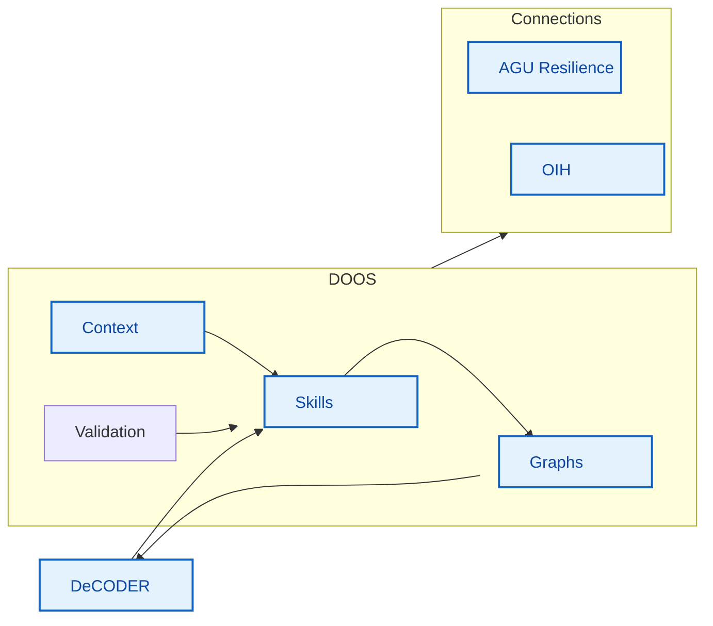


---

## "Executive" summary

May and June 2026 focused on **deepening the transform/validate toolchain**, **launching
the CCHDO dual-output pipeline** (schema.org + MLCommons Croissant), **scaling SHACL
validation**, and **standing up the BODC subproject** end-to-end through federated-export
readiness.

| Metric | Value |
|--------|-------|
| Commits (May–Jun) | **20** |
| May commits | 4 |
| June commits | 16 |
| Primary contributor | Douglas Fils |
| Major new subproject pipeline | **BODC** (4 phases complete) |
| New transform path | CCHDO NetCDF → JSON-LD + Croissant via SHACL-AF |

**Headline outcomes:**

1. **CCHDO** — NetCDF metadata extraction and SHACL-AF rules for schema.org and Croissant 1.1
2. **shapeValidator** — parallel pyrudof + Parquet streaming for production-scale validation
3. **BODC** — depth inventory, live harvest, SHACL validation, and export of 442 validated series
4. **AI/SHACL skills** — six-stage `shaclskills` bundle with LangGraph orchestration

---

## DOOS mission (context)

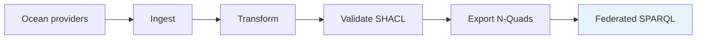

DOOS (Deep Ocean Observation System) federates ocean observation metadata into a
consistent **depth profile** graph — ensuring `DepBelowSurf` in `variableMeasured`
is present and queryable across providers.

**Live endpoints:**

- SPARQL: https://qlever.geocodes-aws-dev.earthcube.org/graphspace/deepoceans
- Search UI: https://qlever-test.geocodes-aws-dev.earthcube.org/

---

## Activity timeline

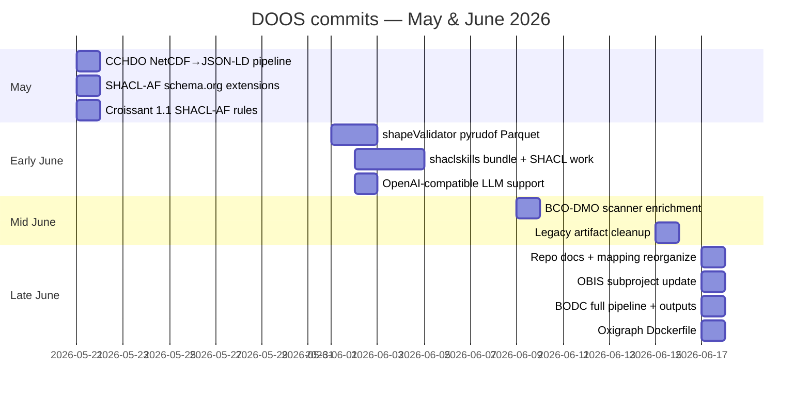

---

## Workstreams

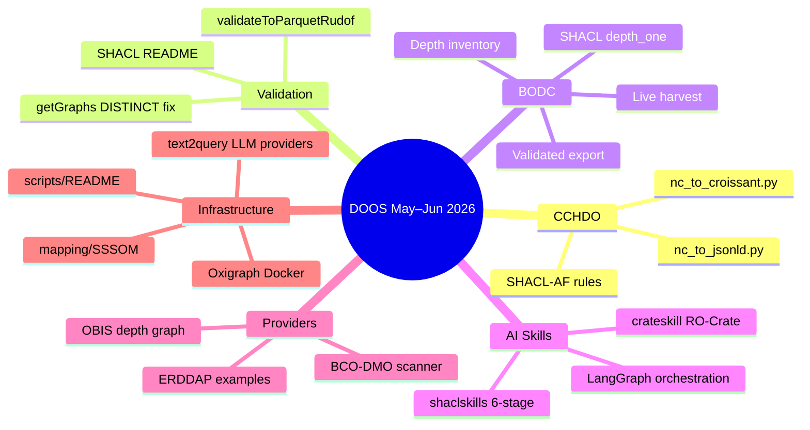

---

## May 2026 — CCHDO transform expansion

**Commits:** 4 (all 21 May)

Established a **second transform approach** for bottle NetCDF metadata using SHACL-AF
SPARQL rules — complementing JSON-LD templates, RML, XSLT, and SSSOM already used
by other providers.

### Deliverables

| File | Purpose |
|------|---------|
| [`projects/CCHDO/nc_metadata.py`](../../projects/CCHDO/nc_metadata.py) | Extract NetCDF globals, dimensions, variables → JSON |
| [`projects/CCHDO/nc_to_jsonld.py`](../../projects/CCHDO/nc_to_jsonld.py) | JSON → schema.org Dataset via SHACL-AF |
| [`projects/CCHDO/nc_to_croissant.py`](../../projects/CCHDO/nc_to_croissant.py) | JSON → MLCommons Croissant 1.1 via SHACL-AF |
| [`projects/CCHDO/SHACL_AF/nc_metadata_to_schema.ttl`](../../projects/CCHDO/SHACL_AF/nc_metadata_to_schema.ttl) | schema.org construct rules |
| [`projects/CCHDO/SHACL_AF/nc_metadata_to_croissant.ttl`](../../projects/CCHDO/SHACL_AF/nc_metadata_to_croissant.ttl) | Croissant construct rules |

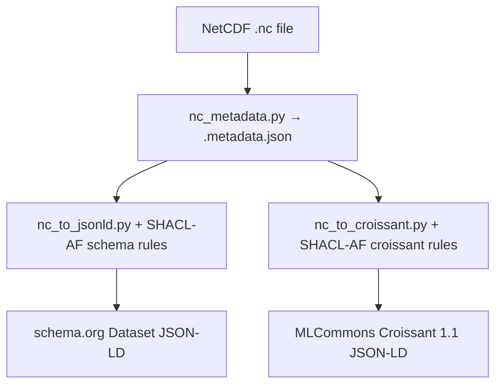

**Impact:** CCHDO can now emit both **OIH-compatible schema.org** and **MLCommons
Croissant** from the same intermediate metadata — documented in
[`projects/CCHDO/README.md`](../../projects/CCHDO/README.md).

---

## June 2026 — Validation & infrastructure

### shapeValidator scaling (1–2 Jun)

| Commit | Change |
|--------|--------|
| `a2cc232` | `validateToParquetRudof.py` + shared `parquet_streaming.py` |
| `0373a26` | `getGraphs.py` — DISTINCT on unlimited graph discovery query |

Three validation engines now coexist:

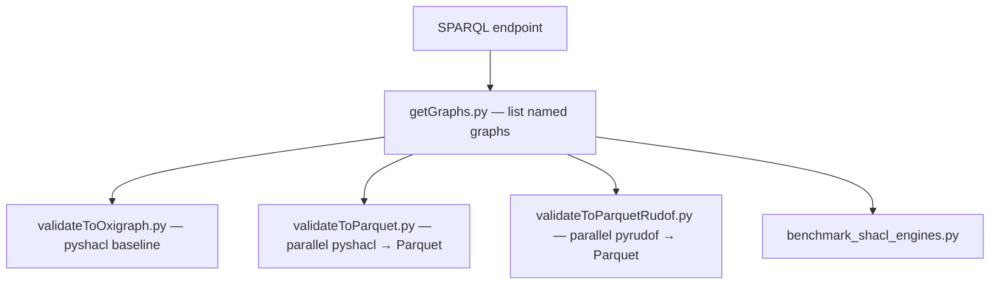

See [`scripts/shapeValidator/README.md`](../../scripts/shapeValidator/README.md).

### SHACL documentation (17 Jun)

[`SHACL/README.md`](../../SHACL/README.md) documents OIH shape files including
[`depth_one.ttl`](../../SHACL/depth_one.ttl) (requires `DepBelowSurf` in `variableMeasured`).

### Oxigraph Docker (17 Jun)

[`build/Dockerfile`](../../build/Dockerfile) — in-memory Oxigraph SPARQL server for
local development and testing.

---

## June 2026 — AI / SHACL skills bundle (2 Jun)

**Commits:** `73fffc1`, `0a7be66`, `8ab2c38`

Added [`skills/shaclskills/`](../../skills/shaclskills/) — a six-stage pipeline turning
dataset URLs into validated, trustworthy RDF:

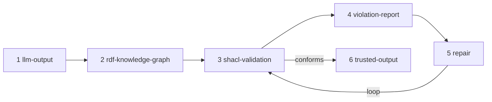

- LangGraph orchestration in `orchestration/`
- pytest coverage for stages 1–5
- OpenAI-compatible LLM provider support in `text2query/`
- Companion [`skills/crateskill/`](../../skills/crateskill/) for RO-Crate packaging

Mid-month cleanup (`e9ec51c`) removed legacy notebook artifacts; the skills bundle
remains as the active AI-validation path.

---

## June 2026 — Repository organization (17 Jun)

**Commit:** `52b63fb`

Consolidated scattered assets into clearer homes:

| Area | Change |
|------|--------|
| [`mapping/SSSOM/`](../../mapping/SSSOM/) | SSSOM-driven flat-JSON → schema.org transform + examples |
| [`docs/`](../../docs/) | `sources.md`, `vision.md`, `shellScraping.md`, example data |
| [`scripts/SPARQLupdate/`](../../scripts/SPARQLupdate/) | SPARQL load utilities (renamed from `SPARQL/updates/`) |
| [`scripts/text2query/`](../../scripts/text2query/) | DSPy natural-language → SPARQL |
| Root [`README.md`](../../README.md) | Project overview + provider status table |
| [`CLAUDE.md`](../../CLAUDE.md) / [`AGENTS.md`](../../AGENTS.md) | Agent/coding guidance |

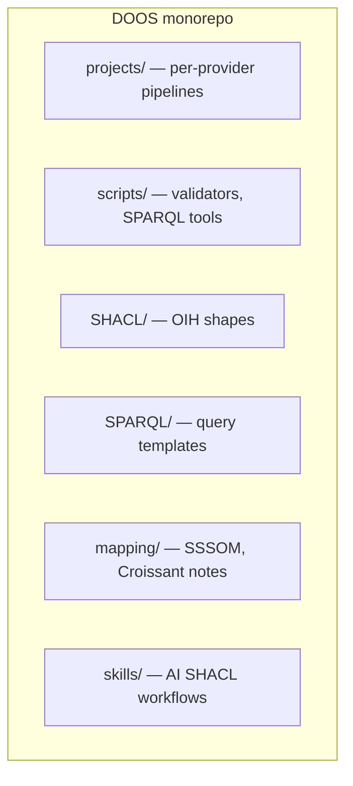

---

## June 2026 — BODC subproject (17 Jun)

**Commit:** `79c4529` (+ planning docs)

Largest single deliverable of the period: a **complete four-phase pipeline** for the
British Oceanographic Data Centre. BODC already publishes schema.org JSON-LD — no
transform layer required.

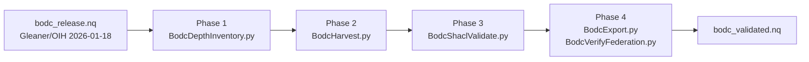

### Depth coverage (743 BODC series)

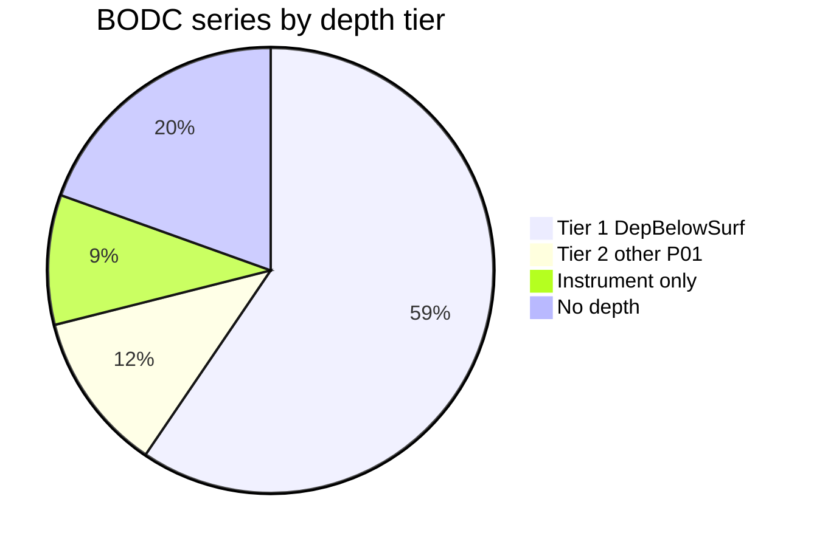

| Metric | Value |
|--------|-------|
| Series in Gleaner/OIH release | 743 |
| Tier 1 (`DepBelowSurf`) | **442 (59.5%)** |
| Tier 2 only | 86 (11.6%) |
| SHACL pass — Tier 1 series | **100%** (442/442, any graph) |
| Exported validated series | **442** |
| Exported quads | 53,911 |

### Key artifacts

| Path | Description |
|------|-------------|
| [`projects/BODC/PLAN.md`](../../projects/BODC/PLAN.md) | Implementation plan |
| [`projects/BODC/README.md`](../../projects/BODC/README.md) | Quickstart + outputs |
| [`projects/BODC/scripts/`](../../projects/BODC/scripts/) | Five CLI tools + shared `bodc_depth.py` |
| [`projects/BODC/output/depth_inventory.json`](../../projects/BODC/output/depth_inventory.json) | Per-graph depth classification |
| [`projects/BODC/output/shacl_results.json`](../../projects/BODC/output/shacl_results.json) | SHACL pass/fail report |
| [`projects/BODC/output/bodc_validated.nq`](../../projects/BODC/output/bodc_validated.nq) | Load-ready export |
| [`SPARQL/varMes_bodc.rq`](../../SPARQL/varMes_bodc.rq) | DepBelowSurf min/max query |

**Federation status:** local SPARQL verification passes (270 `DepBelowSurf` result rows);
federated endpoint load pending via [`scripts/SPARQLupdate/insertUpdates.py`](../../scripts/SPARQLupdate/insertUpdates.py).

---

## June 2026 — Other provider activity

### OBIS (`baeb094`, 17 Jun)

Refreshed [`projects/OBIS/`](../../projects/OBIS/):

- Consolidated `build_depth_graph.py` pipeline (parquet → JSON-LD → N-Quads)
- Updated `pyproject.toml`, loader scripts, QUICKSTART
- Auxiliary depth graph pattern for datasets lacking per-record depth in API metadata

### BCO-DMO (`4d7453e`, `29ff7b0`)

- Added JSON-LD metadata for **12 new datasets** in scanner output
- Scanner URL fixes and access review documentation
- See [`skills/bco-dmo-scan/README.md`](../../skills/bco-dmo-scan/README.md) (scanner moved from `projects/BCO-DMO/`)

### ERDDAP (`f7565c6`, 17 Jun)

- Moved anibos example JSON from `SHACL/` to [`projects/ERDDAP/`](../../projects/ERDDAP/)

---

## Provider status (end of period)

From [`README.md`](../../README.md):

| Subproject | Provider | Status |
|------------|----------|--------|
| ARGO | Argo GDAC | Augmenting graphs ready |
| OBIS | OBIS | Augmenting graphs ready |
| ERDDAP | NOAA OSMC | Indexing |
| CCHDO | CCHDO bottle data | Indexing — **new dual pipeline May** |
| BCO-DMO | BCO-DMO | Starting — scanner active |
| AODN | AODN | Needs mapping workflow |
| **BODC** | **BODC** | **Indexing — pipeline complete Jun** |
| CIOOS | CIOOS | Candidate |

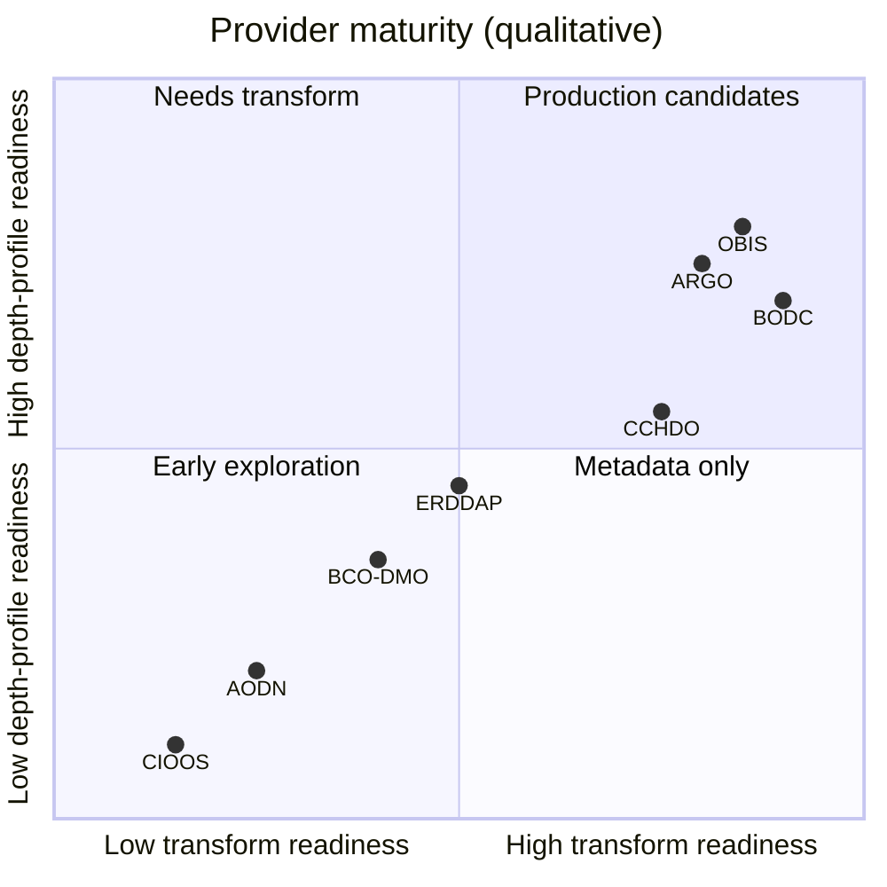

---

## Transform approaches (after May–Jun)

| Approach | Provider(s) | Added/updated this period |
|----------|---------------|---------------------------|
| JSON-LD templates | BCO-DMO, OBIS | BCO-DMO scanner output +12 datasets |
| RML / morph-kgc | ARGO, geoparquet | — |
| XSLT ISO 19139 | AODN | — |
| SSSOM field mappings | mapping/SSSOM | **New** `sssom_to_jsonld.py` + examples |
| SHACL-AF SPARQL rules | **CCHDO** | **New** schema.org + Croissant rules |
| API-native schema.org | **BODC** | **New** inventory/validate/export pipeline |

---

## Scripts & tooling updates

| Tool | Update |
|------|--------|
| [`scripts/sparqlQueryl.py`](../../scripts/sparqlQueryl.py) | Fixed broken `yl1.rq` ref; CLI with endpoint + `--query` |
| [`scripts/README.md`](../../scripts/README.md) | Documented all script directories |
| [`scripts/loadToOxigraph/`](../../scripts/loadToOxigraph/) | Oxigraph load helper + k8s yaml |
| [`text2query/text2SPARQL.py`](../../scripts/text2query/text2SPARQL.py) | OpenAI-compatible providers |

---

## Commit log (full)

| Date | Hash | Summary |
|------|------|---------|
| 2026-06-17 | `efb5a80` | Add Dockerfile for in-memory Oxigraph SPARQL server |
| 2026-06-17 | `79c4529` | Several updates across the board (BODC pipeline, SPARQL, scripts) |
| 2026-06-17 | `b9eb920` | Rewrite README with project overview and current status |
| 2026-06-17 | `baeb094` | OBIS update |
| 2026-06-17 | `52b63fb` | Clean up repository structure and update documentation |
| 2026-06-17 | `0d34502` | Document SHACL shape files in SHACL/README.md |
| 2026-06-17 | `f7565c6` | Move anibos example files from SHACL/ to projects/ERDDAP/ |
| 2026-06-15 | `e9ec51c` | Remove legacy notebook and Stage 1–2 workflow artifacts |
| 2026-06-09 | `4d7453e` | Add JSON-LD metadata for 12 new BCO-DMO datasets |
| 2026-06-02 | `29ff7b0` | changes to URL in scanner |
| 2026-06-02 | `3417503` | generate CLAUDE.md file |
| 2026-06-02 | `8ab2c38` | Support any OpenAI-compatible LLM provider |
| 2026-06-02 | `0a7be66` | Add shaclskills bundle with SHACL-for-AI-outputs pipeline |
| 2026-06-02 | `73fffc1` | work on the SHACL and associated skills and assets |
| 2026-06-01 | `0373a26` | fix(getGraphs): add DISTINCT to unlimited query |
| 2026-06-01 | `a2cc232` | feat(shapeValidator): parallel pyrudof Parquet validator |
| 2026-05-21 | `17d832f` | Update README to cover Croissant pipeline |
| 2026-05-21 | `d53c0b2` | Add MLCommons Croissant 1.1 mapping via SHACL-AF |
| 2026-05-21 | `cea200f` | Extend SHACL-AF variable mapping (5 schema.org properties) |
| 2026-05-21 | `961a46a` | Add nc_to_jsonld.py for NetCDF to JSON-LD conversion |

---

## Open items & next steps

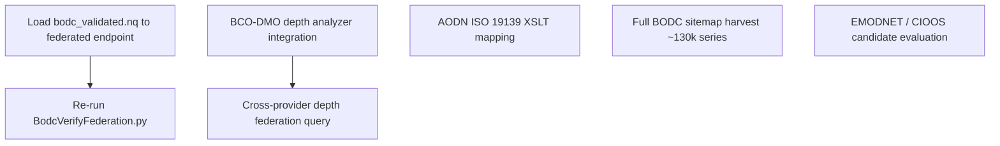

| Priority | Item |
|----------|------|
| High | Load BODC `bodc_validated.nq` to deepoceans QLever; verify `varMes_bodc.rq` remotely |
| High | Continue BCO-DMO collaboration — depth metadata from distributions |
| Medium | AODN XML → schema.org mapping workflow |
| Medium | Run full BODC sitemap harvest (rate-limited; ~130k series) |
| Low | Evaluate EMODNET, CIOOS, OceanSITES as new subprojects |

---

## Suggested presentation flow

1. **Slide 1–2:** Mission + federated depth-profile goal ([`README.md`](../../README.md))
2. **Slide 3:** Timeline gantt (May CCHDO → June BODC)
3. **Slide 4:** CCHDO dual pipeline diagram
4. **Slide 5:** shapeValidator architecture
5. **Slide 6:** BODC four-phase pipeline + pie chart metrics
6. **Slide 7:** Provider status table + quadrant chart
7. **Slide 8:** shaclskills six-stage flow
8. **Slide 9:** Next steps

---

## References

- Project overview: [`README.md`](../../README.md)
- Architecture notes: [`CLAUDE.md`](../../CLAUDE.md)
- Data sources tracker: [`docs/sources.md`](../sources.md)
- BODC plan: [`projects/BODC/PLAN.md`](../../projects/BODC/PLAN.md)
- CCHDO pipelines: [`projects/CCHDO/README.md`](../../projects/CCHDO/README.md)
- SHACL shapes: [`SHACL/README.md`](../../SHACL/README.md)
- Validator suite: [`scripts/shapeValidator/README.md`](../../scripts/shapeValidator/README.md)
