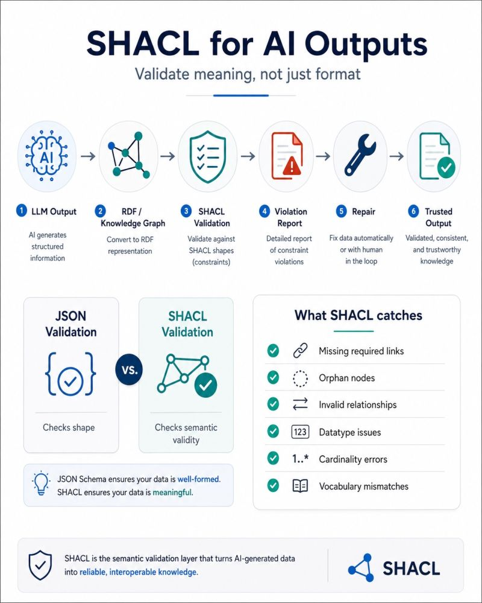

# SHACL for AI Outputs — Skill Bundle

Turn a **dataset URL** into **validated, trustworthy RDF**. This bundle runs an
LLM-extracted metadata record through an RDF + SHACL pipeline that *validates
meaning, not just format*: JSON Schema proves data is well-formed; SHACL proves
it is meaningful (required links, no orphan nodes, datatypes, cardinality,
vocabulary).



Inspired by the LinkedIn post:
<https://www.linkedin.com/feed/update/urn:li:activity:7466950260523757568/>

## The flow

```
1 llm-output → 2 rdf-knowledge-graph → 3 shacl-validation
   → 4 violation-report → 5 repair ─┐
                                    ├─(loop back to 3 until conforms)→ 6 trusted-output
        3 shacl-validation ◄────────┘
```

| # | Stage | What it does | LLM? |
|---|-------|--------------|:----:|
| 1 | **llm-output** | Fetch the URL; reuse embedded schema.org JSON-LD, else LLM-extract `url/name/description/keywords` | fallback |
| 2 | **rdf-knowledge-graph** | Deterministically lift to a `schema:Dataset` Turtle graph | no |
| 3 | **shacl-validation** | Validate with pySHACL against the Google Dataset shape | no |
| 4 | **violation-report** | Tag each finding with a deterministic `fixType`; enrich prose | optional |
| 5 | **repair** | Fix from source / coerce / remove / LLM-reword; loop back to 3 | optional |
| 6 | **trusted-output** | Write a RAiD-style provenance record + narrative | optional |

Each stage is an independent, atomic **skill** — a `SKILL.md` (usable standalone
in Claude Code) plus an `assets/` directory with an importable + CLI-runnable
module. A **LangGraph driver** (`orchestration/`) sequences 1→6 with the repair
loop.

## Layout

```
shaclskills/
  PLAN.md                       # design spec + decisions + build status
  README.md                     # this file
  1-llm-output/      SKILL.md  assets/extract.py  schema.json  extract_prompt.md
  2-rdf-knowledge-graph/ SKILL.md  assets/lift.py  jsonld_context.json  examples/
  3-shacl-validation/ SKILL.md  assets/validate.py  googleRecommended.ttl
  4-violation-report/ SKILL.md  assets/parse_report.py  violation_schema.json
  5-repair/          SKILL.md  assets/repair.py  reprompt_template.md
  6-trusted-output/  SKILL.md  assets/render_record.py  raid_template.json  narrative_prompt.md
  orchestration/     run.py  graph.py  nodes.py  state.py  llm.py
  runs/                         # per-run working dirs (gitignored)
```

The validation engine is reused from the sibling `../shapeValidator/`.

## Setup

Dependencies are managed by `uv` from the repo root (`pyproject.toml`):
`langgraph`, `langchain-openai`, `pyshacl`, `rdflib`, `pyld`. No install step is
needed beyond `uv` resolving them on first run.

Optional LLM steps use **OpenRouter** (OpenAI-compatible) via LangChain. Without
a key, the pipeline still runs fully — LLM steps degrade to deterministic
behavior. To enable them:

```bash
export OPENROUTER_API_KEY=sk-or-...
export OPENROUTER_MODEL=anthropic/claude-3.5-sonnet   # any OpenRouter model slug
```

## Quickstart

Run the whole pipeline on a dataset URL (from this directory):

```bash
uv run python -m orchestration.run "https://your.dataset/landing-page"
```

Add `--no-llm` to force deterministic-only, `--max-iterations N` to bound the
repair loop (default 3), `--run-id ID` to name the run. `file://` URLs work for
local fixtures. Example output:

```
=== pipeline trace ===
  stage1: source=embedded-jsonld
  stage2: 7 triples
  stage3: conforms=True violations=0
  stage4: autofixable_violations=False
  stage6: conforms=True -> 06_raid.json
=== result ===
  run dir:     .../runs/<id>
  conforms:    True (violations=0, warnings=12, repair passes=0)
  RAiD record: .../runs/<id>/06_raid.json
```

Exit code is `0` when the final graph conforms (zero blocking violations), `1`
otherwise. The final, validated graph is `runs/<id>/05_graph.ttl` (or
`02_graph.ttl` if no repair ran); the provenance record is `06_raid.json`.

## Running a single stage

Every stage runs on its own against the shared run-dir files — handy for
debugging:

```bash
RUN=runs/dev
python 1-llm-output/assets/extract.py        "<url>"            --out-dir $RUN
python 2-rdf-knowledge-graph/assets/lift.py   $RUN/01_extracted.json --out-dir $RUN
python 3-shacl-validation/assets/validate.py  $RUN/02_graph.ttl  --out-dir $RUN
python 4-violation-report/assets/parse_report.py $RUN/03_results.json --out-dir $RUN
python 5-repair/assets/repair.py              $RUN/02_graph.ttl $RUN/04_report.json --out-dir $RUN
python 6-trusted-output/assets/render_record.py $RUN
```

See each stage's `SKILL.md` for the importable API and details.

## Run directory contract

Stages are stateless and communicate through files in `runs/<id>/`:

| File | Written by | Contents |
|------|-----------|----------|
| `00_input.json` | driver | `{ "url": … }` |
| `01_extracted.json` | 1 | `{ url, name, description, keywords[], source }` |
| `02_graph.ttl` | 2 | `schema:Dataset` graph (Turtle) |
| `03_report.ttl` | 3 | `sh:ValidationReport` graph |
| `03_results.json` | 3 | normalized result rows (Stage 4 input) |
| `03_conforms.json` | 3 | `{ conforms, raw_conforms, n_violations, n_warnings, n_info }` |
| `04_report.json` | 4 | `{ summary, findings[] }` (fix-oriented) |
| `04_report.md` | 4 | human-readable report |
| `05_graph.ttl` | 5 | repaired graph (re-validated by 3) |
| `06_raid.json` | 6 | RAiD-style provenance record |
| `06_record.md` | 6 | narrative + facts |
| `run.log` | 5 | repair audit trail |

**Conformance is by severity, not pySHACL's raw boolean.** pySHACL reports
`conforms=False` whenever *any* result exists — including `sh:Warning`. Here
`conforms` means **zero `sh:Violation` results**; the recommended-field warnings
do not fail conformance.

## The SHACL shape

`3-shacl-validation/assets/googleRecommended.ttl` targets `schema:Dataset` (all
IRIs `https://schema.org/`). Severities follow Google's Dataset guidance:

- **Required (`sh:Violation`):** `name`, `description` (50–5000 chars), and
  `contentUrl` within any `distribution`.
- **Recommended (`sh:Warning`):** `url`, `identifier`, `keywords`, `license`,
  `creator`, `publisher`, `citation`, `variableMeasured`, temporal/`spatialCoverage`,
  `sameAs`, `alternateName`, `version`, `distribution`.

To change what's blocking, flip a property's `sh:severity` in the `.ttl`.

## Tests

A pytest suite locks in the deterministic behaviors (LLM forced off, so it runs
anywhere):

```bash
uv run pytest -c scripts/shaclskills/pytest.ini scripts/shaclskills/tests
```

30 tests cover: Stage 1 JSON-LD reuse / normalization / honest no-data; Stage 2
mapping, IRI policy, determinism; Stage 3 conformance-by-severity and the
`http`/`https` namespace guard; Stage 4 `fixType`/`autoFixable` mapping, sorting,
and schema validity; Stage 5 add-from-source loop closure, `remove-extra`, and
no-fabrication; and the driver end-to-end (happy path conforms; short
description → one repair pass then no-progress stop).

## Design principles

- **Deterministic where it matters.** Stages 2 and 3, and all repair-loop
  control flow (`fixType`/`autoFixable`, stop conditions), are pure code. The
  LLM only handles extraction fallback and human-facing prose/reword.
- **Never fabricate facts.** Repair adds values only from the source record or
  summarizes text the dataset already implies (e.g. `description`). Factual
  fields with no source value (creator, license, …) are left unfixed, not
  invented.
- **Graceful without a key.** Every stage runs deterministically when no
  `OPENROUTER_API_KEY` is set; the loop then *stops* on unfixable findings
  rather than closing them.

## Status & roadmap

All six stages, the driver, and the skill docs are built and verified. See
`PLAN.md` for the full spec and the remaining polish items: choosing
`OPENROUTER_MODEL`, picking golden test URLs, confirming the required/recommended
shape split for DOOS, and revisiting the (provisional, best-effort) RAiD mapping.
