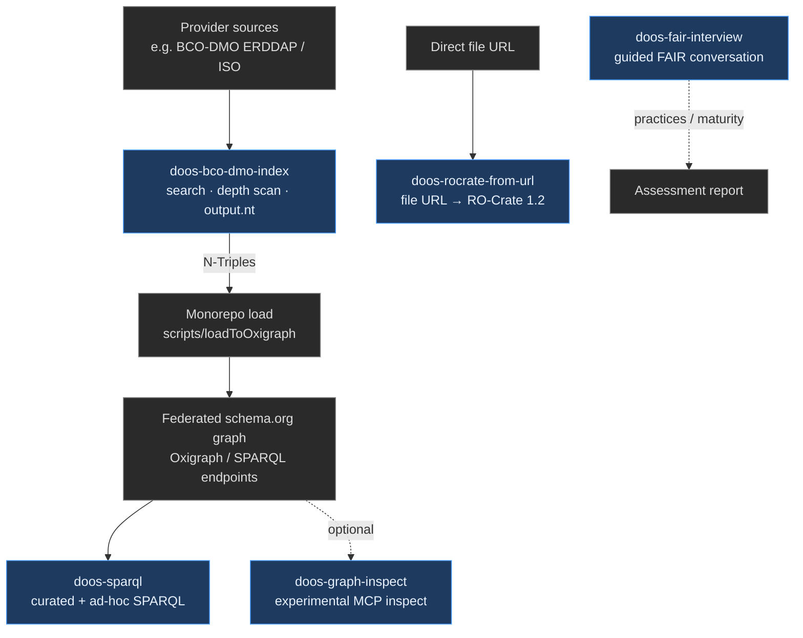

# DOOS Skill Bundle

Agent skills for the **Deep Ocean Observation System (DOOS)** monorepo: harvest
and index ocean-metadata sources, query the federated schema.org graph, package
artifacts, and support FAIR practice conversations.

These are **independent** skills — each has its own `SKILL.md`, scripts, and
optional assets. They share a `doos-` name prefix so they are easy to discover
together. For the staged SHACL validate/repair pipeline, see the sibling
[`../SHACL_bundle/`](../SHACL_bundle/) (`decoder-*` skills).

## How they fit DOOS

These skills are not a single forced sequence, but they map onto the usual
DOOS path: **index provider metadata → load the graph → query it**, with side
paths for packaging and FAIR practice work.



| Path | Skills |
|------|--------|
| **Data pipeline** | `doos-bco-dmo-index` → monorepo load → graph → `doos-sparql` (preferred) or `doos-graph-inspect` |
| **Packaging** | `doos-rocrate-from-url` (standalone; any downloadable file) |
| **Practice / process** | `doos-fair-interview` (standalone; person or repository) |

## Skills

### [`doos-bco-dmo-index`](doos-bco-dmo-index/)

**BCO-DMO ERDDAP search → ISO depth scan → merged N-Triples.**

Searches the BCO-DMO ERDDAP catalog (or walks the full catalog), inventories
access routes, scans ISO 19115 for depth/pressure variables, and builds
schema.org JSON-LD in the ODIS depth pattern. Primary output is merged
`output.nt` suitable for Oxigraph load. Prefer `assets/run_pipeline.py` for the
full flow; see the skill’s own `README.md` for CLI detail.

*Use when:* indexing BCO-DMO, finding depth-related datasets, or producing
BCO-DMO RDF for the federated graph.

---

### [`doos-sparql`](doos-sparql/)

**Portable SPARQL against DOOS schema.org endpoints.**

Runs curated templates (`probe_triples`, `depth_assay`, `variable_measured`,
named graphs, …) or ad-hoc SPARQL 1.1 via a small CLI. Templates target
schema.org + GeoSPARQL patterns used in DOOS named graphs (Oxigraph, QLever,
etc.). Always requires an explicit endpoint URL.

*Use when:* exploring the live graph, inventorying `variableMeasured` / depth
(`DepBelowSurf`), or answering structured questions over federated metadata.

---

### [`doos-fair-interview`](doos-fair-interview/)

**Guided FAIR practices interview (not automated scoring).**

A conversational skill that walks a person or repository through Findability,
Accessibility, Interoperability, Reusability, and implementation questions,
then can write a structured assessment report. It does **not** score metadata
files mechanically; it is an expert interview harness.

*Use when:* assessing how a team or repository approaches FAIR, or producing a
maturity-style FAIR report from a live conversation.

---

### [`doos-graph-inspect`](doos-graph-inspect/)

**Experimental RDF graph inspection via MCP helpers.**

Thin wrapper around graph MCP client scripts for asking open-ended questions
about graph contents (types, resources). Prefer **`doos-sparql`** for portable,
reproducible SPARQL against a known endpoint.

*Use when:* probing a graph MCP session experimentally; not the default path
for production queries.

---

### [`doos-rocrate-from-url`](doos-rocrate-from-url/)

**Download a file URL → Attached RO-Crate 1.2.**

Fetches a directly downloadable file and packages it as a minimal Research
Object Crate (`ro-crate-metadata.json` + payload), including CreateAction
provenance for the download.

*Use when:* packaging a single remote file as an RO-Crate for sharing or
archival handoff.

---

## Layout

```text
DOOS_bundle/
├── README.md                 # this file
├── doos-bco-dmo-index/       # BCO-DMO → RDF indexing
├── doos-sparql/              # SPARQL templates + CLI
├── doos-fair-interview/      # FAIR interview skill
├── doos-graph-inspect/       # experimental graph MCP helpers
└── doos-rocrate-from-url/    # URL → RO-Crate
```

Each skill directory contains a `SKILL.md` (agent instructions) and either
`assets/` or `scripts/` for the runnable code.

## Related

| Path | Role |
|------|------|
| [`../SHACL_bundle/`](../SHACL_bundle/) | Six-stage decoder pipeline: extract → lift → SHACL → report → repair → provenance |
| Monorepo `SPARQL/`, `SHACL/`, `scripts/loadToOxigraph/` | Shared queries, shapes, and graph load tooling used with these skills |

From the DOOS repo root, activate the monorepo venv before running Python CLIs:

```bash
source .venv/bin/activate
```
